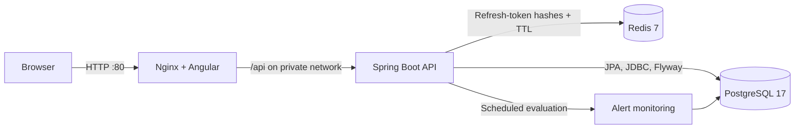

# Solaris

Solaris is a full-stack solar energy monitoring application for managing installations and viewing energy production, consumption, storage, and operational alerts. It combines an Angular dashboard with a Spring Boot API, PostgreSQL persistence, and Redis-backed refresh-token rotation.

## Problem and objectives

Solar installations produce operational data across sites, field devices, meters, and batteries. Solaris brings that information into one role-aware application so administrators can maintain the system inventory and homeowners can inspect only their own energy data. The project focuses on clear monitoring workflows, durable telemetry history, constrained administrative changes, and authentication that remains stateless at the API layer.

## Implemented features

- Account registration, login, logout, JWT access tokens, and single-use refresh-token rotation.
- Separate administrator and homeowner routes in both the API and Angular application.
- Administrator management of users, solar sites, devices, batteries, system thresholds, and alerts.
- Homeowner profile and password management, owned-site views, 24-hour summaries, raw energy readings, storage history, alerts, and daily reports.
- Ownership checks that prevent one homeowner from reading another homeowner's sites, storage, telemetry, or alerts.
- Scheduled monitoring for offline devices, low batteries, high consumption, and low production, with duplicate-alert cooldowns.
- Flyway-managed PostgreSQL schema and JDBC-based daily energy aggregation.
- Responsive Angular UI with light/dark themes, route guards, automatic access-token refresh, and nested-route fallback.
- A Docker Compose deployment with health checks, private service networking, graceful shutdown, and persistent PostgreSQL data.

## Technology stack

| Layer | Technology |
| --- | --- |
| Frontend | Angular 22.2, TypeScript 6, Angular Material/CDK, RxJS 7.8 |
| Frontend build/runtime | Node.js 26.5 build stage, Nginx 1.28 runtime |
| Backend | Java 25, Spring Boot 4.1.1, Spring MVC, Spring Security, Spring Data JPA/JDBC |
| Build | Gradle Wrapper 9.7.1, npm 12.0.2 with `package-lock.json` |
| Data | PostgreSQL 17, Flyway, Hibernate |
| Session support | Redis 7 for expiring refresh-token records |
| Authentication | Signed JWT access/refresh tokens, BCrypt passwords, role-based authorization |

## Architecture

The browser talks to a single origin. Nginx serves Angular routes and forwards `/api` requests to the backend over the private Compose network. Spring Boot validates access tokens, applies role and ownership rules, runs Flyway migrations, persists domain data in PostgreSQL, and atomically consumes refresh tokens in Redis.



Only Nginx is published to the host in the normal Compose deployment. PostgreSQL, Redis, and Spring Boot communicate using the `postgres`, `redis`, and `backend` service names on the dedicated `solaris` network.
The default production file publishes HTTP port 80 and no database or Redis host port. Database tools such as DBeaver can connect only when `compose.dev.yaml` is included explicitly; those development bindings are limited to `127.0.0.1`.

## Repository structure

```text
Solaris/
├── backend/                 Spring Boot source, tests, Gradle wrapper, and Dockerfile
│   └── src/main/resources/db/migration/
├── frontend/                Angular source, tests, Nginx config, and Dockerfile
├── output/api/              Postman collection and the latest live API test report
├── output/pdf/              API/architecture guide
├── compose.yaml             Production-style full-stack Compose definition
├── compose.dev.yaml         Optional database ports for local IDE development
└── .env.example             Required configuration template
```

## Docker setup

### Prerequisites

- Docker Desktop or Docker Engine with Docker Compose v2.
- At least 2 GB of free memory for the first Java, Angular, and container image builds.
- Free host port `80` for the production-style web entry point.

Java, Gradle, Node.js, npm, PostgreSQL, and Redis do not need to be installed for the Docker workflow.

### Environment configuration

Create a local configuration without overwriting an existing `.env`:

```bash
test -f .env || cp .env.example .env
```

Edit `.env` and replace at least `DB_PASSWORD` and `JWT_SECRET`. The JWT secret must contain at least 32 random bytes. A suitable value can be generated with `openssl rand -base64 48`.

| Variable | Purpose | Example/default in template |
| --- | --- | --- |
| `DEVELOPMENT` | Explicit mode flag; keep `false` for production and set `true` only for local debugging | `false` |
| `POSTGRES_VOLUME_NAME` | Stable PostgreSQL volume name | `solaris_postgres_data` |
| `REDIS_VOLUME_NAME` | Stable Redis refresh-token volume name | `solaris_redis_data` |
| `SPRING_PROFILES_ACTIVE` | Active Spring profile label | `production` |
| `DB_HOST`, `DB_PORT` | Host/port for a locally run backend; Compose overrides these with `postgres:5432` | `localhost`, `5432` |
| `DB_NAME`, `DB_USER`, `DB_PASSWORD` | PostgreSQL database and credentials | local values |
| `REDIS_HOST`, `REDIS_PORT` | Host/port for a locally run backend; Compose overrides these with `redis:6379` | `localhost`, `6379` |
| `REDIS_PASSWORD` | Optional Redis password; leave empty only for trusted local development | empty |
| `JWT_SECRET` | HMAC signing secret used only by the backend | no usable default |
| `JWT_ACCESS_TOKEN_TTL` | Access-token lifetime | `15m` |
| `JWT_REFRESH_TOKEN_TTL` | Refresh-token and Redis-record lifetime | `7d` |
| `MONITORING_FIXED_DELAY` | Delay between alert scans, in milliseconds | `60000` |

No database, Redis, or JWT secret is embedded in the frontend. Angular uses the same-origin `/api` base path in both development and production.

### Start the complete application

```bash
docker compose up --build -d
```

The first build downloads the pinned Gradle distribution, Java dependencies, npm packages, and base images. Follow startup and migration logs with:

```bash
docker compose logs -f backend frontend
```

### Access URLs and ports

| Resource | URL | Published port |
| --- | --- | --- |
| Solaris web application | <http://localhost> | `80` |
| REST API through Nginx | <http://localhost/api> | `80` |
| Frontend health check | <http://localhost/health> | `80` |
| PostgreSQL | private `postgres:5432` | none |
| Redis | private `redis:6379` | none |
| Spring Boot | private `backend:8080` | none |

## Service behavior

- `frontend` builds Angular with `npm ci`, serves the production bundle as an unprivileged Nginx user, falls back to `index.html` for client routes, and proxies `/api` to `backend`.
- `backend` builds the executable JAR with the repository's Gradle wrapper and runs it as an unprivileged user. Its health check includes database and Redis connectivity.
- `postgres` stores application data in the named `solaris_postgres_data` volume by default.
- `redis` stores expiring refresh-token hashes in an append-only data volume. Refresh tokens are consumed atomically during rotation and logout.

Compose waits for PostgreSQL and Redis health before starting the API, and waits for API health before starting Nginx. Each application still reports dependency failures through health and logs rather than treating ordering as permanent availability.

## Database persistence and migrations

Flyway runs the migrations in `backend/src/main/resources/db/migration` during backend startup. Hibernate uses `ddl-auto: validate`; it verifies the mapped schema but does not recreate it.

The Compose volume name is deliberately stable:

```text
solaris_postgres_data
```

This matches the repository's existing Docker database volume. Redis uses the separate `solaris_redis_data` volume so valid refresh-token records survive routine container replacement. Normal rebuilds, restarts, `docker compose stop`, and `docker compose down` do not delete either volume. Do **not** run `docker compose down -v` unless permanent database and session-state deletion is explicitly intended and a verified database backup exists.

Changing `DB_NAME`, `DB_USER`, or `DB_PASSWORD` does not rewrite credentials inside an already initialized PostgreSQL volume. If those values change, update the existing database role safely or select the correct existing volume instead of deleting it.

## Authentication and authorization

Public registration creates a `HOMEOWNER`. Login returns a short-lived access token and a longer-lived refresh token. Only a SHA-256 digest and ownership metadata for each refresh token are kept in Redis. Refresh and logout atomically consume that record, so a token cannot be reused after rotation or revocation.

Spring Security restricts `/api/admin/**` to `ADMIN` and `/api/homeowner/**` to `HOMEOWNER`. The backend also reloads the user for each access token so disabling an account or changing a role takes effect before token expiry. Homeowner queries include owner IDs at the repository/SQL boundary; resources owned by someone else are returned as not found.

The Angular guards and menus provide role-appropriate navigation, but they are not the security boundary. The backend enforces every protected API call. Tokens are currently held in browser local storage, so production deployment requires a strong Content Security Policy, careful dependency review, HTTPS, and protection against script injection.

## API overview

The implemented endpoint groups are:

- `/api/auth/**` — registration, login, refresh, and logout.
- `/api/admin/users`, `/sites`, `/devices`, `/batteries`, `/settings`, and `/alerts` — administrator operations.
- `/api/homeowner/profile`, `/sites`, `/energy`, `/storage`, `/reports`, and `/alerts` — homeowner-scoped operations.

The importable [Postman collection](output/api/Solaris.postman_collection.json) contains the concrete requests and payloads. The [API guide](output/pdf/Solaris_API_Guide_for_Django_Developers.pdf) provides a longer endpoint and architecture reference. Interactive OpenAPI/Swagger UI is not currently included.

## Useful Compose commands

```bash
# Validate interpolation and the merged model without printing secrets.
docker compose config --quiet

# Show container and health status.
docker compose ps

# Follow all service logs, or one service only.
docker compose logs -f
docker compose logs -f backend

# Rebuild and replace one service after a source change.
docker compose up --build -d backend
docker compose up --build -d frontend

# Stop containers but keep them and all data.
docker compose stop

# Remove containers/network while retaining the PostgreSQL volume.
docker compose down
```

`docker compose down -v` is destructive and is intentionally not part of the normal workflow.

## Local development and debugging

For IDE debugging or Angular's development server, set `DEVELOPMENT=true` and
`SPRING_PROFILES_ACTIVE=development` in your local `.env`. Then publish PostgreSQL and Redis on
loopback with the development-only override:

```bash
docker compose -f compose.yaml -f compose.dev.yaml up -d postgres redis
```

Run the backend on the workstation:

```bash
cd backend
set -a
source ../.env
set +a
./gradlew bootRun
```

In another terminal, run Angular with its checked-in proxy configuration:

```bash
cd frontend
npm ci
npm start
```

The development UI is then available at <http://localhost:4200>; `/api` is proxied to the local backend at `http://localhost:8080`. Stop the development data services with the same file set:

```bash
docker compose -f compose.yaml -f compose.dev.yaml stop postgres redis
```

## Testing and build verification

Backend unit and integration tests use H2 in PostgreSQL compatibility mode and do not alter the Compose database:

```bash
cd backend
./gradlew clean test
./gradlew clean build
```

Frontend checks use the committed lockfile:

```bash
cd frontend
npm ci
npm test -- --watch=false
npm run build
```

Container verification:

```bash
docker compose config --quiet
docker compose build
docker compose up -d
docker compose ps
curl --fail http://localhost/health
curl --fail http://localhost/login >/dev/null
curl --fail http://localhost/admin/users >/dev/null
```

The final URL checks confirm both static serving and Angular nested-route fallback. The disposable authenticated HTTP suite can be run through the Nginx proxy from the repository root when its required controlled admin credentials are available:

```bash
SOLARIS_BASE_URL=http://localhost python3 backend/scripts/live_api_e2e.py
```

It writes its assertion report to `output/api/live-api-test-report.json` and removes its own PostgreSQL fixtures after the run.

## Troubleshooting

### Port 80 is already in use

Stop the conflicting web server or change the host-side `80` mapping in `compose.yaml` deliberately.
PostgreSQL and Redis should remain unpublished in the production file.

### PostgreSQL or Redis is unhealthy

Inspect the specific logs and health state:

```bash
docker compose logs postgres redis
docker compose ps
```

Confirm `.env` has non-empty database credentials. If Redis has a password, the same `REDIS_PASSWORD` is used for the Redis server, backend, and health check.

### Backend does not become healthy

Run `docker compose logs backend`. Common causes are a JWT secret shorter than 32 bytes, credentials that do not match an already initialized PostgreSQL volume, a failed Flyway migration, or unavailable Redis. Fix the configuration or migration problem; do not reset the database volume to hide it.

### Existing database appears empty

Stop before writing data and check `POSTGRES_VOLUME_NAME`. The expected default is `solaris_postgres_data`. Point Compose at the correct existing volume rather than creating or deleting volumes.

### A nested frontend route returns 404

Use the Nginx-served Compose URL, not a directory listing or raw build output. `frontend/nginx.conf` routes unknown non-API paths back to Angular's `index.html`. Rebuild `frontend` if the configuration changed.

### Browser API calls return 502

Nginx could not reach a healthy backend. Check `docker compose ps` and `docker compose logs backend`; the browser should always call `/api`, never a Docker hostname or `localhost:8080` hardcoded in the bundle.

## Security and production notes

- Keep `.env` out of version control and use a secret manager or orchestrator secrets in production.
- Terminate TLS before the frontend and send only HTTPS traffic to users.
- The production Compose file binds HTTP port 80 on the host. Apply the appropriate firewall and reverse-proxy rules before exposing it publicly.
- Rotate the JWT secret with an explicit session invalidation plan because changing it invalidates all signed tokens.
- Back up PostgreSQL before schema changes and verify Flyway migrations against a copy of production data.
- Redis is part of the authentication path. Monitor it and choose an appropriate persistence/high-availability policy for a production environment.
- Review the local-storage token model and add a restrictive Content Security Policy before an internet-facing deployment.

## Future improvements

- Add OpenAPI generation and an interactive API explorer.
- Add a non-interactive, secret-safe administrator bootstrap workflow for fresh deployments.
- Add browser end-to-end tests covering login, refresh rotation, role navigation, and responsive layouts.
- Add production TLS, centralized secret management, database backups, and monitoring/metrics dashboards.

## License

Solaris is currently maintained as a personal/academic project; no separate license file is included.
